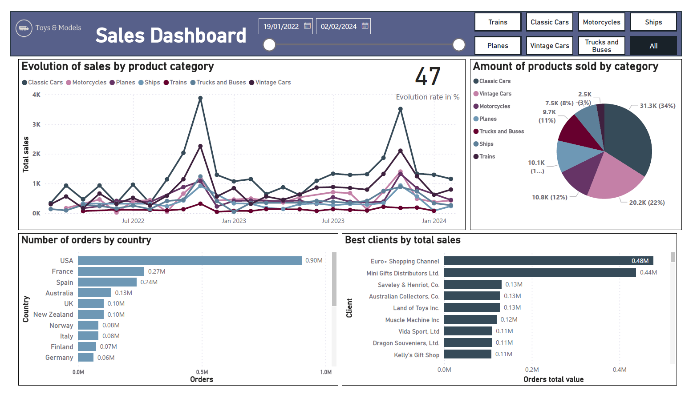
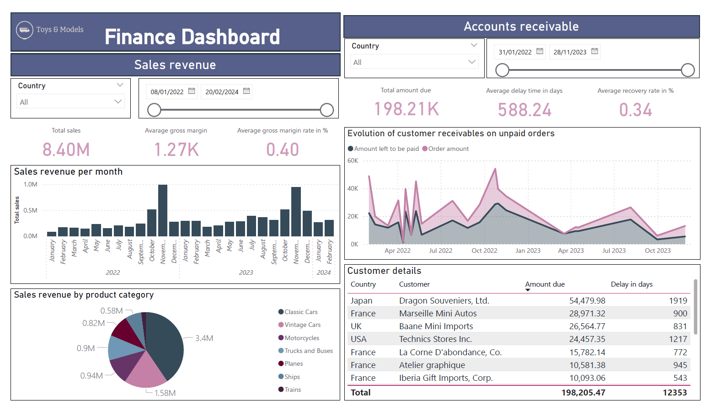

# Power-BI-dashbords-project
Example company dashboards - Created interactive dashboards that summarized sales, HR, logistics and finance key metrics for a toy company by merging several tables in a dataset using SQL and presenting final results with Power BI.

.
